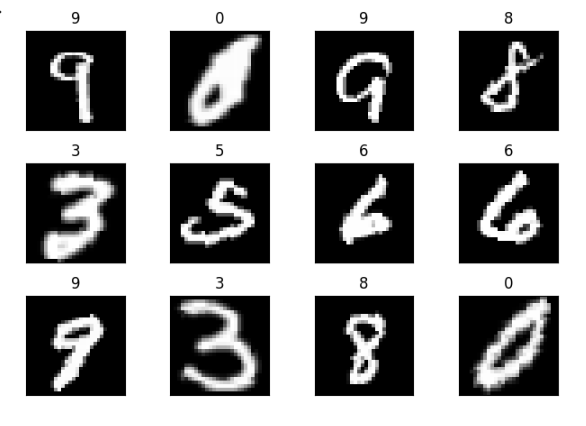
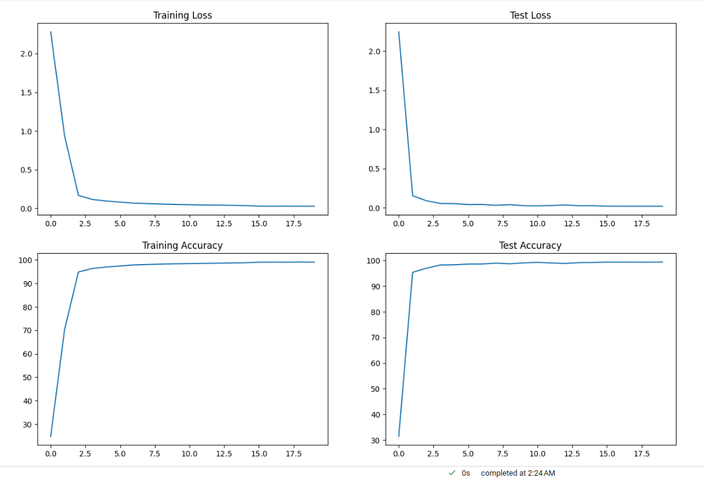
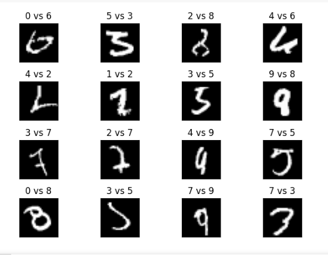

# Neural Network Image Classification - MNIST DataSet

## Description

This project includes three Python files: `model.py`, `utils.py`, and `S5.ipynb`. These files are part of a machine learning project for image classification using the MNIST dataset. The project is about training a neural network model to recognize handwritten digits.

Few samples in the dataset are shown below.




## Files

### 1. model.py

This file provides the neural network model architecture for image classification. This file consists of 2 classes - 'Net' and 'Net2". Both these are subclasses of `torch.nn.Module` and consists of several convolution and fully connected layers. The `forward` method implements the forward pass of the model, and the `summary` method provides a summary of the model's architecture. The following shows model summary for 'Net' architecture.

```
============================================================================================================================================
Layer (type:depth-idx)                   Input Shape               Output Shape              Param #                   Param %
============================================================================================================================================
Net                                      [1, 28, 28]               [1, 10]                   --                             --
├─Conv2d: 1-1                            [1, 28, 28]               [32, 26, 26]              320                         0.05%
├─Conv2d: 1-2                            [32, 26, 26]              [64, 24, 24]              18,496                      3.12%
├─Conv2d: 1-3                            [64, 12, 12]              [128, 10, 10]             73,856                     12.45%
├─Conv2d: 1-4                            [128, 10, 10]             [256, 8, 8]               295,168                    49.76%
├─Linear: 1-5                            [1, 4096]                 [1, 50]                   204,850                    34.53%
├─Linear: 1-6                            [1, 50]                   [1, 10]                   510                         0.09%
============================================================================================================================================
Total params: 593,200
Trainable params: 593,200
Non-trainable params: 0
Total mult-adds (M): 727.92
============================================================================================================================================
Input size (MB): 0.00
Forward/backward pass size (MB): 0.70
Params size (MB): 2.37
Estimated Total Size (MB): 3.08
============================================================================================================================================
```
The `Net2` class consists of several convolution without biases and fully connected layers without biases where as the 'Net' class has layers with biases.
This files also has train and test functions which return the train loss, train accuracy, test loss and test accuracy respectively. 
This file also has new code logic comprised in a function get_incorrect_test_predictions to obtain the samples of mis-classifications.


### 2. utils.py

The `utils.py` file contains helper functions that are used throughout the project. These functions provide some common functionalities for data preprocessing, visualization, or any other necessary operations. It includes functions for plotting the model train / test loss/accuracy statistics (function: display_model_stats), displaying the data images (function: display_data), ploting the test incorrect classification predictions (function: plot_test_incorrect_predictions).

### 3. S5.ipynb

The `S5.ipynb` file is the main module that runs the image classification activity for MNIST dataset. It contains the code for training and evaluating a neural network model using the MNIST dataset. The file includes the following components:

- Importing necessary libraries and dependencies
- Mounting Google Drive
- Setting up the device (CPU or GPU)
- Defining data transformations for training and testing
- Loading the MNIST dataset
- Setting up data loaders
- Displaying sample data from the training set
- Defining the neural network model and displaying its summary
- Training the model using SGD optimizer and cross-entropy loss
- Displaying model training and testing statistics
- Plotting incorrect test predictions
- Defining an alternative neural network model (Net2) and displaying its summary

Please note that this README is dynamically generated and serves as a placeholder. As you make further modifications to the project, remember to update this file accordingly. Provide a brief description of each file, its purpose, and its relevance to the project's functionality.

For more detailed information on the project's implementation and code, please refer to the individual files mentioned above.

## Usage

To run the project, make sure you have the dependencies installed.
```
pip install -r requirements.txt
```
You can execute the `S5.ipynb` notebook to perform the training and testing. Adjust the hyperparameters such as learning rate, momentum, batch size, and number of epochs to improve the model performance as desired.

Below are few results provided by utils functions at the respective places in S5 notebook.

### 1. Model Training and Test Stats

```
display_model_stats(train_loss, train_accuracy, test_loss, test_accuracy)
```



### 2. Sample Mis-classified Instances (Predicted vs Actual):

```
plot_test_incorrect_predictions(incorrect_pred)
```


